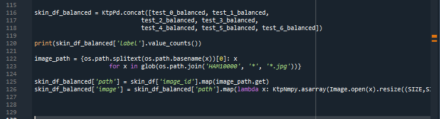

# ClassificationOfSkinDiseases
## Hospitals can easily identify the disease
## Distribution Rates of Data

The columns show the properties of the images. It seems that the number of certain diseases in the data set is small. The solution to this problem would be to take equal amounts of images and train them.
## Data Set Sync

It takes n_samples(7) samples for each class in the skin_df_balanced dataset and generates graphs. These graphs show an equal number of samples for each class and ensure that the data set is evenly distributed. This creates a more accurate data set for the model to learn from and allows the model to make more accurate predictions.
It is then used to separate the dataset into training and test data. First, the images in the 'image' column are assigned to the Yty variable as a list. Then the variable Yty converts the values ​​between 0-255 between 0-1. The 'label' column is assigned to the dky variable and converted to categorical variables with the to_categorical() function.
The train_test_split() function converts the data set into training and test data. Yty and Dky_cat data are separated into training and test data. With test_size=0.20, 20% of the data set is used as test data, then 80% is training data. Random_state=42 ensures that the same data is selected each time.
 

In these rows, it converts the class labels in the "dx" column to numeric values. First, an object of the "LabelEncoder" class is created and a list of the labels in the "dx" column is given with the "fit" method. Next, the list of tags converted with the "classes_" property is printed. Finally, the labels in the "dx" column are converted to numeric values ​​with the "transform" method and added to the "label" column as a new column. The "skin_df.sample(10)" function prints samples of 10 randomly selected lines.

It is used to visualize data. First, a 4x2 chart is created.
1.ax1: Shows the numbers of cell types in the "dx" column as a bar graph.
2.ax2: Shows the numbers of the genders in the "sex" column as a bar graph.
3.ax3: Shows the number of settlements in the "localization" column as a bar graph.
4.ax4: Shows the distribution of ages in the "age" column.
Finally, the graphs are displayed on the screen with the plt.show() function.

## Data Set Sharing

It ensures that the data set is shared equally. First of all, test_0_balanced, test_1_balanced, test_2_balanced... etc. are created separately for each class. combines variables with the KtpPd.concat() function. With this function, instances of all classes are combined into a single dataset and assigned to the variable skin_df_balanced.
Finally, skin_df_balanced['label'].value_counts() shows that equal numbers of samples are retrieved and all classes are represented equally.

## Training Layers

Creates a Convolutional Neural Network (CNN) model for image classification.
The first layer of the model, the Conv2D layer, is created with 256 filters and a (3.3) dimensional kernel. After setting the Activation function to "relu" and input_shape=(SIZE, SIZE, 3) the MaxPool2D layer is used to make the input data smaller. With pool_size=(2, 2) the data is filtered in a 2x2 field.
Dropout layer, we have ensured that the network is protected against overfitting.

The other layers of the model are created in the same way. Finally, the Dense layer that outputs the model has an output of 32 neurons and 7 classes (num_classes=7). Activation function is set to "softmax".
The summary of the model is displayed and the model is compiled. With the compile() function, the loss function is set to 'categorical_crossentropy', the optimizer function to 'Adam' and metrics to 'acc'.

Trains the model using training data and tests the performance of the model.
With the fit() function, the model is trained and the data is iterated 90 times as Yty_train and Dky_train, with epochs=90. We set batch_size=16. Test data is also used with validation_data=(Yty_test, Dky_test).
With the evaluate() function, the performance of the model is tested and the test accuracy value is printed.
Finally, the model is saved as "result". In this way, the model can be used later.

## Epoch Value

After training the data, the accuracy rate was max 0.85. 
